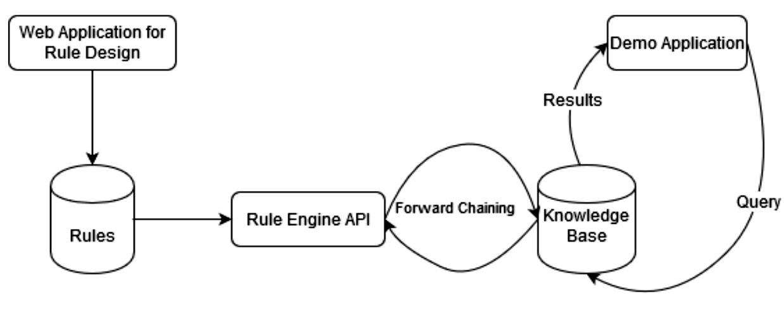

# SWRE

SWRE is an acronym that stands for _Semantic Web Rule Rule Engine_

## Introduction

***Semantic Web:*** The Semantic Web is an extension of the World Wide Web through standards set by the World Wide Web Consortium (W3C). The goal of the Semantic Web is to make Internet data machine-readable. To enable the encoding of semantics with the data, technologies such as Resource Description Framework (RDF) and Web Ontology Language (OWL) are used. These technologies are used to formally represent metadata. For example, ontology can describe concepts, relationships between entities, and categories of things. These embedded semantics offer significant advantages such as reasoning over data and operating with heterogeneous data sources. [source](http://github.com)

The readme mostly explains the content of the project and how the internal connections are working. For more information about the semantic web and OWL, refer to the documentation provided with the project or the internet or books.

## Architecture

Semantic Web was an attempt by Sir Tim Berners Lee to view the World Wide Web as a big database i.e. the content on each website can be queried and inferences can be evaluated from the same. The following project revolved around the architecture shown in the figure below.

***Brief walk through:*** With reference to the design stated above, SWRE is 
